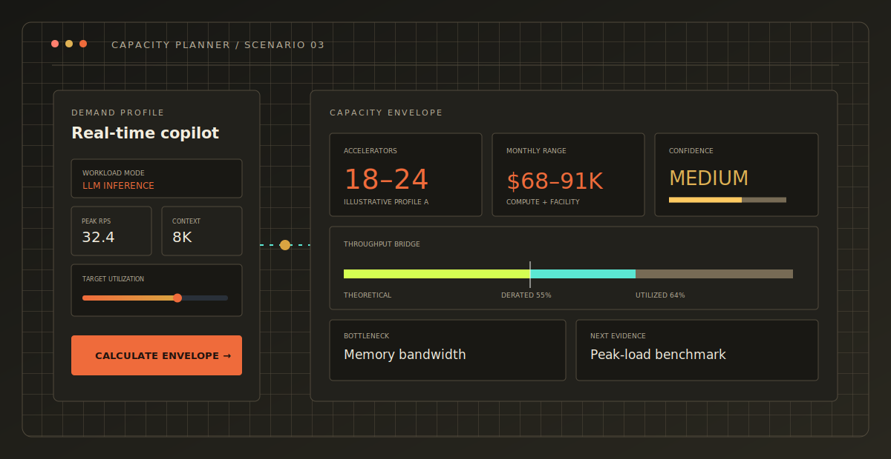
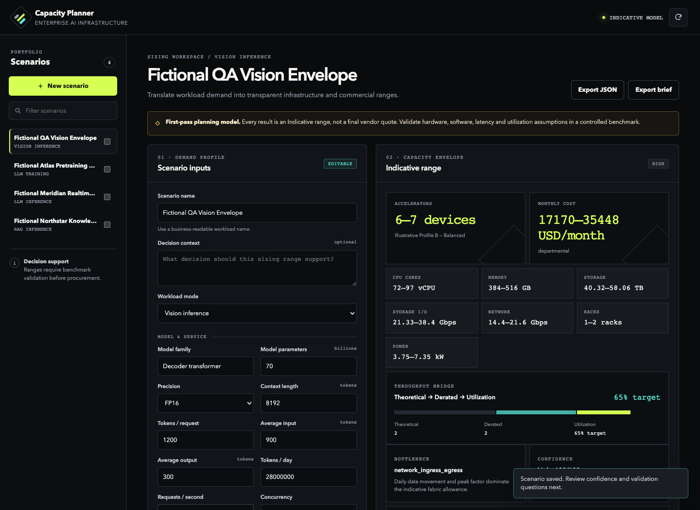
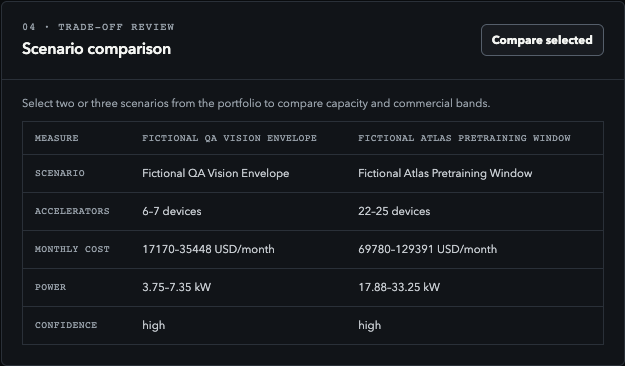
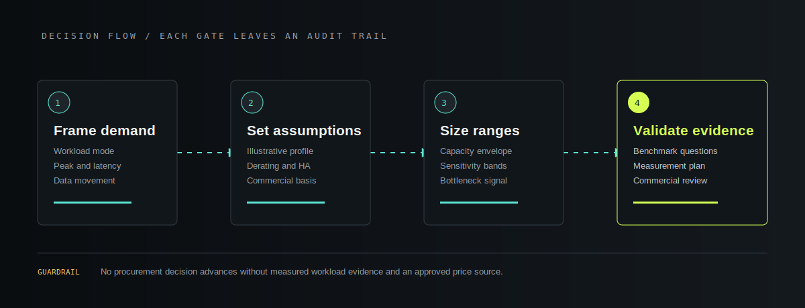
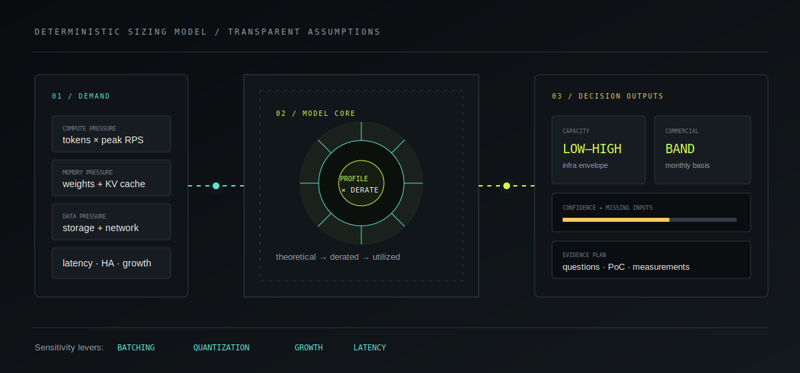

# Enterprise AI Capacity & Commercial Sizing Planner

[](https://github.com/daetan999/ai-infra-capacity-planner/actions/workflows/ci.yml)
[](https://www.python.org/)
[](https://fastapi.tiangolo.com/)
[](LICENSE)



A runnable, explainable first-pass planner for translating an AI workload into indicative
infrastructure and commercial ranges before formal benchmarking. It makes assumptions, missing
evidence, bottleneck hypotheses, and validation questions visible instead of presenting a fake
exact bill of materials.

This portfolio implementation uses only fictional scenarios and generic illustrative hardware
profiles. It does not produce a vendor quote, replace formal benchmarking, or replace a Solutions
Engineer review.

## Product tour

### Scenario workspace



Create or edit a workload, tune explicit planning assumptions, and inspect compute, memory, storage,
network, rack, power, cost, utilization, confidence, and validation ranges in one workspace.

### Side-by-side comparison



Compare fictional training, real-time inference, and RAG scenarios without hiding differences in
precision, target utilization, demand growth, latency, or evidence quality.

## Planning workflow



1. **Frame demand** — select the workload mode and record model, traffic, data, latency, availability,
   region, and growth inputs relevant to that mode.
2. **Expose assumptions** — review the illustrative accelerator profile, derating, target utilization,
   power, and pricing source type.
3. **Calculate ranges** — produce deterministic low/base/high planning ranges, never a single exact
   bill of materials.
4. **Find the constraint** — identify the likely compute, memory, storage, network, latency, or
   completion-window bottleneck.
5. **Test sensitivity** — show how batching, quantization, growth, and latency expectations change the
   result.
6. **Qualify confidence** — turn absent or assumed inputs into a confidence deduction and explicit
   technical questions.
7. **Plan validation** — define a bounded proof of concept, measurement plan, and commercial review
   gate.
8. **Export the brief** — share the scenario and visible assumptions as JSON or Markdown.

## Deterministic sizing model



The calculation engine supports:

- LLM training
- LLM inference
- RAG inference
- Vision inference
- Batch AI or HPC workloads

Each result distinguishes theoretical throughput, production-derated throughput, and target
utilization. Configurable profiles in `data/accelerator_profiles.yaml` contain a generic illustrative
name, memory, theoretical throughput, derating factor, power range, price assumption source type,
and an explicit illustrative flag. Vendor marketing claims are not embedded throughout the code.

Outputs include indicative ranges for accelerators, CPUs, memory, storage capacity, network,
racks, power, monthly compute cost, and expected utilization, plus storage-throughput and
network-bandwidth considerations. The engine also returns the primary bottleneck hypothesis,
confidence score, missing inputs, benchmark assumptions, next questions, proposed PoC workload,
measurement plan, and indicative commercial opportunity band.

## Commercial relevance

- **Early qualification:** separates a credible infrastructure opportunity from an unbounded AI idea.
- **Discovery quality:** reveals which traffic, model, data, latency, availability, and growth facts are
  still assumptions.
- **Solution alignment:** gives account teams and engineers a reproducible starting point for a deeper
  sizing session.
- **Commercial framing:** communicates an opportunity band without presenting fictional precision as
  a quote.
- **PoC control:** converts the bottleneck hypothesis into measurable validation work and decision
  criteria.
- **Change analysis:** makes growth, batching, precision, and latency trade-offs visible before a
  design hardens.

## Demo scenarios

The application can seed three fictional examples:

- a time-bounded foundation-model training run;
- a latency-sensitive real-time LLM inference service;
- a retrieval-augmented inference service with growing document storage.

No customer names, proprietary configurations, credentials, production telemetry, supplier quotes,
or real opportunity values are included. Runtime scenarios are stored in a local SQLite database
excluded from version control.

## Quick start

Requirements: Python 3.12 or later.

```bash
git clone https://github.com/daetan999/ai-infra-capacity-planner.git
cd ai-infra-capacity-planner
python -m venv .venv
source .venv/bin/activate
pip install -e '.[dev]'
cp .env.example .env
uvicorn app.main:app --reload
```

Open `http://127.0.0.1:8000`. To run the container instead:

```bash
docker compose up --build
```

## API surface

| Method | Route | Purpose |
|---|---|---|
| `GET` | `/health` | Liveness response |
| `GET` | `/api/scenarios` | List saved scenarios and their latest result |
| `POST` | `/api/scenarios` | Validate, calculate, and save a scenario |
| `GET` | `/api/scenarios/{id}` | Retrieve one scenario and result |
| `PUT` | `/api/scenarios/{id}` | Recalculate a scenario with edited inputs |
| `DELETE` | `/api/scenarios/{id}` | Delete a local scenario |
| `POST` | `/api/scenarios/compare` | Compare selected scenarios and assumptions |
| `GET` | `/api/scenarios/{id}/export?format=json` | Export structured scenario evidence |
| `GET` | `/api/scenarios/{id}/export?format=markdown` | Export a review-ready sizing brief |

Interactive OpenAPI documentation is available at `/docs` while the service is running.

## Verification

```bash
make lint
make test
make coverage
docker build -t capacity-planner .
```

The suite covers deterministic calculation, profile validation, persistence, API errors, export,
demo data, and interface contracts. CI enforces linting, browser-script syntax, an 80% branch-coverage
floor, and a clean-checkout container build. This application is deployed from its repository checkout
or container image; it is not published as a standalone Python wheel.

## Repository map

```text
app/
  domain.py       Workload modes and stable calculation types
  engine.py       Deterministic sizing, confidence, and sensitivity policy
  repository.py   SQLite scenario persistence
  schemas.py      External API validation
  main.py         HTTP, HTML, comparison, export, and demo orchestration
data/             Generic illustrative accelerator profiles
templates/        Product workspace
static/           Responsive interface and interaction logic
tests/            Engine, persistence, API, demo, and UI contract tests
docs/assets/      Product diagrams and verified application screenshots
docs/testing/     RED/GREEN/REFACTOR checkpoints
```

See [architecture](docs/architecture.md) and
[assumptions and guardrails](docs/assumptions-and-guardrails.md) for calculation boundaries and the
evidence required before commercial validation.

## Current limitations

This public implementation is a single-user, local-first planning aid. It does not include supplier
catalog synchronization, live regional price feeds, benchmark execution, topology validation,
reservation or discount modeling, taxes, multi-tenant isolation, authentication, procurement
approval, or production observability. Every result requires human review against measured workload
behavior and current supplier terms.

## License

Released under the [MIT License](LICENSE).

---

[Part of the Enterprise AI Infrastructure Portfolio](https://github.com/daetan999/technical_resume)
