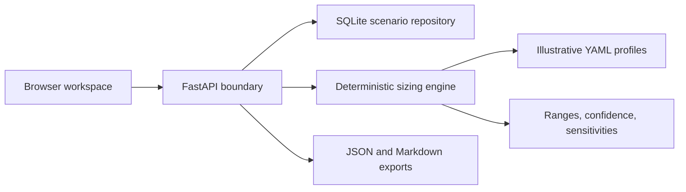

# Architecture

The planner is a deliberately small modular monolith. Its boundaries mirror the conversation a
solutions team has with a customer: capture a scenario, make assumptions explicit, calculate a
reproducible range, and expose the questions that must be answered before a quote.

## Boundaries

- `app/schemas.py` validates external input and defines the API contract.
- `app/repository.py` owns SQLite lifecycle and scenario persistence.
- `app/engine.py` is a side-effect-free calculation boundary backed by explicit profile data.
- `app/main.py` composes the web, API, export, and demo-data surfaces.
- `templates/` and `static/` provide a progressively enhanced browser workflow.

The calculation output is indicative. A saved result retains its explicit assumptions so the same
input produces the same result. No hardware profile or price is represented as a vendor quote.

## Data flow

1. The API validates and normalizes a scenario.
2. The repository stores the input as JSON in SQLite.
3. The engine selects an illustrative accelerator profile and calculates a low/base/high range.
4. Constraint pressure determines the primary bottleneck and confidence deduction.
5. Alternative batching, precision, growth, and latency assumptions generate sensitivities.
6. The API returns the result and can render it as machine-readable JSON or review-ready Markdown.

## Operational model

The container runs as an unprivileged user and persists only its SQLite database under `/app/data`.
The service is stateless apart from that volume. CI exercises linting, coverage, packaging, and a
clean container build.
